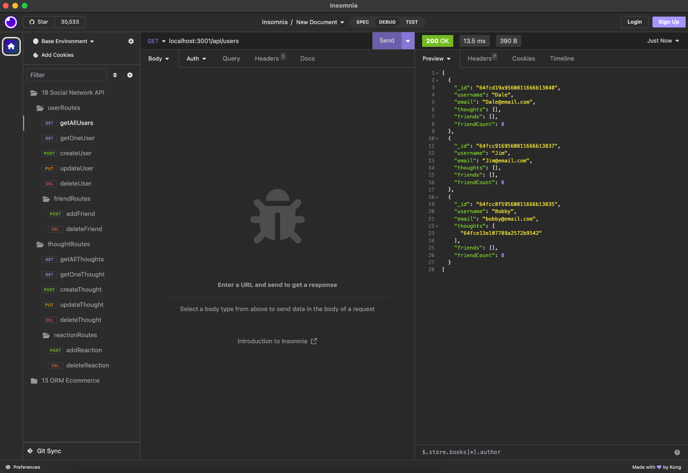

# Social Network API

   
  
  Check out the badges hosted by [shields.io](https://shields.io/).
  
  
  ## Description 
  
  *What, why, and how:* 
  
  We all know how big social networking has gotten and how big of a role it plays in many aspects from our daily lives to our work lives. As a full-stack web developer, I wanted to become better associated with the workings of these platforms. This is a back end project for a social network site. It has no front end. It uses Express.js for routing, a MongoDB database so that it can handle large amounts of unstructured data, and the Mongoose ODM.

  ## Table of Contents
  * [Installation](#installation)
  * [Usage](#usage)
  * [Resources/Credit](#resourcescredit)
  * [License](#license)
  
  ## Installation
  
  *Instructions on how to install project and to get the development environment running:*
  
  - clone this repo to your local device
  - run `npm i`
  
  
  ## Usage 
  
  *Instructions and examples for use:*
  
  - run `npm run dev` in your CLI
  - once the program is running on local port 3001, you can open insomnia to test the routes.

  Usage video: https://drive.google.com/file/d/1Ek2oPBvOZqeSsalh7VtYAPOcEH0CfbRK/view  

  

  ## Resources/Credit
  UCB full-stack bootcamp instructional team:
  - Kayvon
  - UCB full-stack gitlab repo module 18 mini project
  
  ## License
  
  MIT License
  
  ---
  
  ## Questions?

  
  
  For any questions, please contact me with the information below:
 
  GitHub: [@neilmkflyingk](https://api.github.com/users/neilmkflyingk)
  
